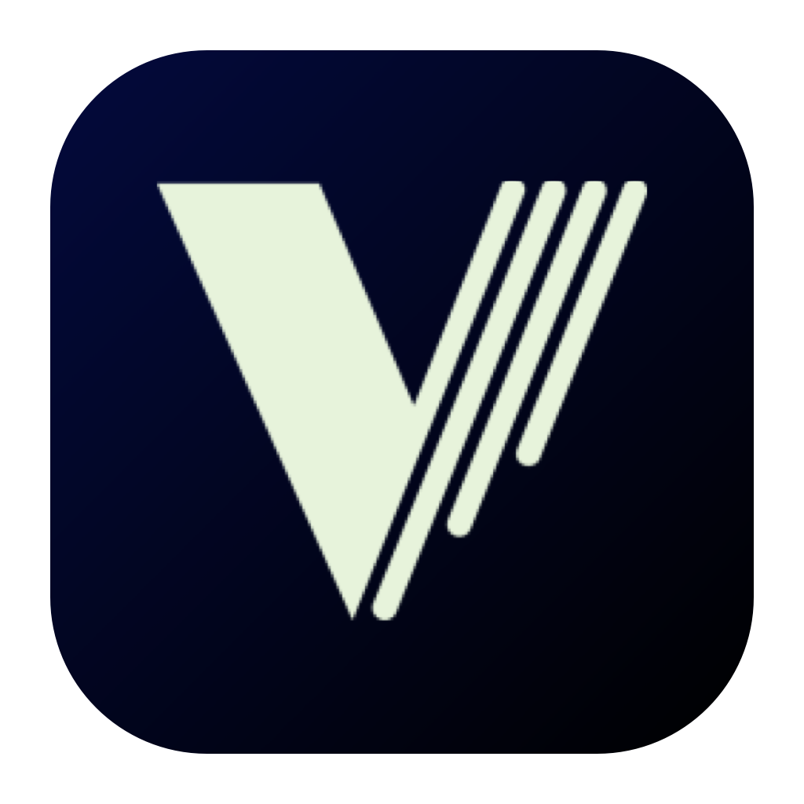
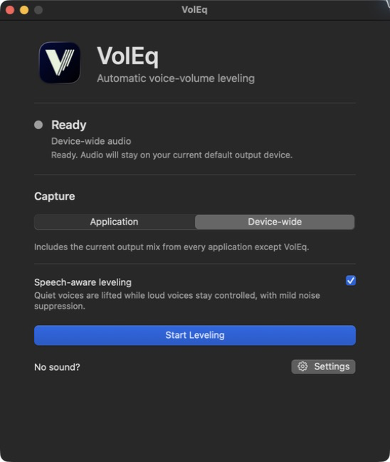

<div align="center">
  
  <h1>VolEq</h1>
  <p><strong>Automatic voice-volume leveling for your Mac.</strong></p>
  <p>
    Quiet speakers become easier to hear. Loud speakers stay controlled.<br>
    Everything is processed locally, with no account, recording, or telemetry.
  </p>
  <p>
    <a href="https://github.com/DPatrikI/voleq-community/releases/latest"><strong>Download</strong></a> ·
    <a href="#features"><strong>Features</strong></a> ·
    <a href="#privacy-by-design"><strong>Privacy</strong></a> ·
    <a href="#build-from-source"><strong>Build</strong></a> ·
    <a href="CONTRIBUTING.md"><strong>Contribute</strong></a>
  </p>
  <p>
    <a href="https://github.com/DPatrikI/voleq-community/releases/latest"></a>
    <a href="https://github.com/DPatrikI/voleq-community/actions/workflows/ci.yml"></a>
    
    
    <a href="LICENSE"></a>
  </p>
</div>

<p align="center">
  
</p>

## Why VolEq

- **Hear voices at a steadier level.** VolEq lifts quiet speech and controls loud
  speech, with linked-stereo leveling and lookahead peak protection.
- **Use it where you need it.** Capture one active audio-producing application
  or the complete device-wide output mix.
- **Boost voices, not background noise.** Speech-aware processing prevents
  puffs, crackles, and background noise from receiving quiet-speech gain.
- **Stay local and private.** Audio is processed only in memory on your Mac—no
  account, recording, telemetry, model download, or online speech service.
- **Get a native Mac experience.** Use VolEq as a focused window or from the
  menu bar.

## Features

- Raises quiet speech and controls loud speech automatically.
- Applies automatic mild noise suppression when speech and background noise are
  both detected.
- Recovers conservatively across output changes, full system sleep, stalled
  audio callbacks, and independently confirmed stale device-wide capture.
- Fails safely when an audio format or route cannot be processed.
- Offers native window and menu-bar presentations.
- Checks for updates only when requested or explicitly enabled.

## Privacy by design

Captured audio is processed only in memory on your Mac. VolEq has no account,
audio recording, telemetry, model download, or online speech service. Manual
update checks—and optional checks enabled by you at most once every 24 hours
while VolEq is open—contact the VolEq Community repository on GitHub. They send
no audio or usage data, and VolEq never downloads or installs an update. See the
full [privacy statement](PRIVACY.md).

## Platform support

| Platform | Status | Requirements |
| --- | --- | --- |
| macOS | Supported | Apple Silicon, macOS 14.2 or newer |
| Windows | Planned | Not yet available |
| Linux | Planned | Not yet available |

## Compatibility and limitations

The default speech-aware path adds approximately **30 ms of DSP latency** at
48 kHz; device and route buffering can add more. See the
[compatibility matrix](docs/COMPATIBILITY.md) for exact validation scope.

- VolEq levels the combined captured mix; it cannot control each meeting
  participant independently.
- Only mono or stereo 32-bit floating-point PCM is supported. Multichannel
  layouts fail safely before processing begins.
- Speech-aware processing is validated at 16, 44.1, and 48 kHz. Fractional
  10 ms rates such as 22.05 kHz are rejected before VolEq replaces the original
  audio.
- Output changes and wake can require route reconstruction. If reconstruction
  cannot complete safely, VolEq stops instead of claiming that leveling resumed;
  failed Core Audio cleanup can require Quit.
- Only applications currently producing audio appear in application capture.
- Singing may be classified as speech and receive leveling or mild suppression.

## Build from source

Building requires Xcode or Apple Command Line Tools with Swift 5.10 or newer.

```sh
./dev doctor
./dev test
./dev build macos
./dev run macos
```

`./dev build macos` assembles the release-shaped, ad-hoc-signed artifact at
`dist/VolEq.app`. `./dev run macos` launches a separately identified
`dist/VolEq Dev.app`, so its local System Audio Recording grant cannot be
confused with an installed release. Official Developer ID signing and
notarization use the maintainer-only `./dev package macos` workflow documented
in [RELEASING.md](docs/RELEASING.md).

## Open-source and Pro editions

This Community repository builds the complete open-source application named
**VolEq**. **VolEq Pro** is planned as a separate application for advanced
controls, profiles, automation, automatic switching, and commercial support—not
a better version of the core processor. See [EDITIONS.md](docs/EDITIONS.md).

## Documentation and community

- [Compatibility](docs/COMPATIBILITY.md)
- [Validation evidence](docs/VALIDATION.md)
- [Architecture](docs/ARCHITECTURE.md)
- [Roadmap](docs/ROADMAP.md)
- [Licensing model](docs/LICENSING.md)
- [Third-party notices](THIRD_PARTY_NOTICES.md)
- [Release procedure](docs/RELEASING.md)
- [Build and contribution guide](CONTRIBUTING.md)
- [Code of conduct](CODE_OF_CONDUCT.md)
- [Security policy](SECURITY.md)
- [LinkedIn](https://www.linkedin.com/in/patrik-istv%C3%A1n-d%C3%B3czy/)
- [X — development updates and future projects](https://x.com/hapci410)

If VolEq makes your meetings easier to listen to, you can support its development
through [GitHub Sponsors](https://github.com/sponsors/DPatrikI). Sponsorship is
optional; VolEq remains free and open source.

## License

Source and documentation are licensed under the
[Mozilla Public License 2.0](LICENSE), unless a file states otherwise. The
**VolEq** name, logo, application icon, and official visual identity are not
licensed under MPL-2.0; see [TRADEMARKS.md](TRADEMARKS.md).
