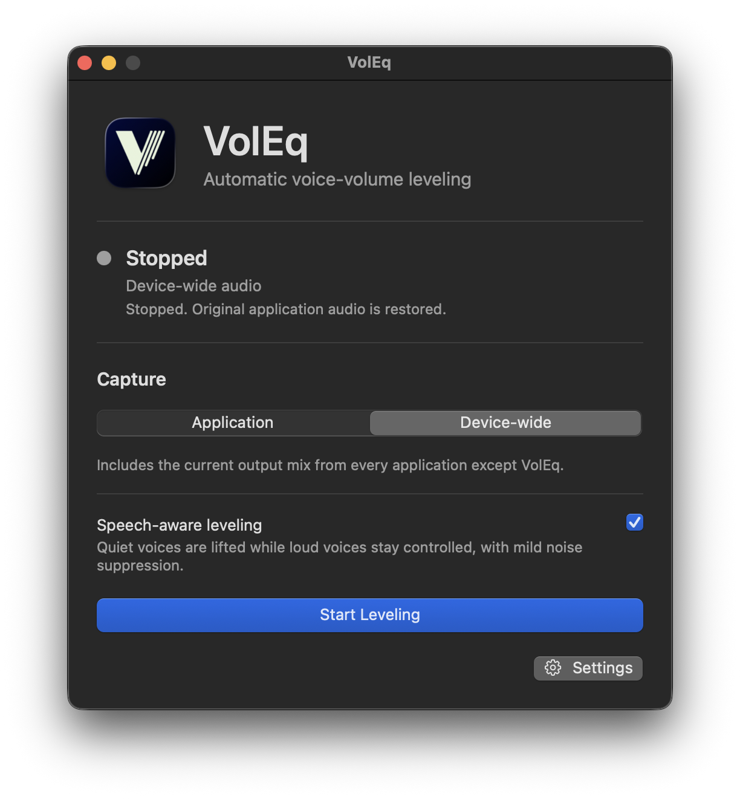

# VolEq — Volume Equilibrium

VolEq automatically levels voice volume so quiet speakers are easier to hear
and loud speakers are less overwhelming.

<p align="center">
  
</p>

## Download and install

Download the Apple Silicon DMG from
[GitHub Releases](https://github.com/DPatrikI/voleq-community/releases), open it,
and drag **VolEq Community** to **Applications**. Launch the installed app and
start audio in the application you want to level, choose Start, and follow the
macOS System Audio Recording prompt.

> **Known v0.1.0 issue:** the published 0.1.0 build can incorrectly enter a
> muting capture path after System Audio Recording access is denied. Stop or
> quit VolEq to restore the original path. The Unreleased 0.1.1 fix described
> in this source tree is pending signed-bundle owner validation and has not yet
> been released.
>
> The owner also reproduced a v0.1.0 sleep/wake failure where VolEq still
> appeared active but produced no sound until stopped and restarted. The
> Unreleased 0.1.1 source immediately leaves Active when sleep begins, tears
> down the old graph, and rebuilds from scratch after wake only once cleanup
> finishes. That replacement behavior is also pending
> signed-bundle owner validation.

In the Unreleased source, the first Start attempt explains why access is needed
before macOS asks for System Audio Recording permission. VolEq then starts the
real audio path, which causes macOS to present its permission prompt. macOS does
not provide VolEq with a separate permission-status API, so VolEq does not try
to infer the setting from captured samples. The always-available **No sound?**
help opens the correct System Settings page if playback is missing.

VolEq Community 0.1.0 requires an Apple Silicon Mac running macOS 14.2 or newer.
See the [tested compatibility matrix](docs/COMPATIBILITY.md) for the exact Macs,
meeting apps, wired outputs, and Bluetooth devices covered before release.

To remove VolEq, first stop leveling and quit the app, then move
`VolEq Community.app` from Applications to the Trash. Its System Audio Recording
permission can be removed separately in System Settings.

## What it does

- Captures one active application or the complete device-wide output mix.
- Raises quiet speech and controls loud speech with linked-stereo leveling and
  lookahead peak protection.
- Prevents music and unrelated sounds from receiving quiet-speech gain.
- Applies automatic mild noise suppression when speech and background noise are
  both detected.
- Supports built-in, wired, and Bluetooth outputs, including microphone-active
  headset call modes.
- Processes audio locally and offline with no account, audio recording,
  telemetry, or model download. Manual or explicitly enabled daily update
  checks contact GitHub without sending audio or usage data.
- Offers native window and menu-bar presentations.

The default speech-aware path introduces approximately **30 ms of DSP latency at
48 kHz**. The measured total is about 31.13 ms at 44.1 kHz and 33 ms at 16 kHz;
device and route buffering can add more. With speech awareness disabled, the
base leveler uses 20 ms lookahead.

## Current limitations

- VolEq levels the combined captured mix; it cannot control each meeting
  participant independently.
- Only mono or stereo 32-bit floating-point PCM is supported. Multichannel
  layouts fail safely before processing begins.
- Speech-aware processing is validated at 16, 44.1, and 48 kHz. Fractional
  10 ms rates such as 22.05 kHz are rejected before VolEq replaces the original
  audio.
- An output change stops processing, restores the original path when cleanup
  completes, validates the new route, and rebuilds the processing path.
- The published 0.1.0 build has a known sleep/wake lifecycle defect. The
  Unreleased source contains a recovery fix, but signed-bundle sleep/wake and
  device coverage is still pending.
- Only applications currently producing audio appear in application capture.
- Singing may be classified as speech and receive leveling or mild suppression.
- The official 0.1.0 binary is arm64-only; Intel Macs are not supported.

## Build from source

Building requires Xcode or Apple Command Line Tools with Swift 5.10 or newer.

```sh
./dev doctor
./dev test
./dev build macos
./dev run macos
```

`./dev build macos` assembles the release-shaped, ad-hoc-signed artifact at
`dist/VolEq Community.app`. `./dev run macos` launches a separately identified
`dist/VolEq Community Dev.app`, so its local System Audio Recording grant cannot
be confused with an installed release. Ad-hoc signatures identify one exact
build: after rebuilding the development app, macOS may require access to be
granted again. If it asks you to quit and reopen the app after granting access,
run `open "dist/VolEq Community Dev.app"` so the permitted binary is relaunched
without another rebuild. Official Developer ID signing and notarization use the
maintainer-only `./dev package macos` workflow documented in
[RELEASING.md](docs/RELEASING.md).

## How it works

On macOS, VolEq uses Core Audio process taps to capture outgoing audio, process
it, and send it to the current output device. Bundled RNNoise states and Apple's
offline SoundAnalysis framework authorize quiet-speech gain and mild
suppression. Loud content retains downward peak protection regardless of its
classification. VolEq mutes the selected original stream only while its
replacement path is active. The first Start explains the local-only audio use,
then the real Core Audio pipeline triggers macOS's System Audio Recording
prompt. VolEq does not run a second signal-based permission probe and does not
claim that silence means permission was denied. If startup or cleanup fails,
VolEq leaves the public state non-running; unresolved Core Audio ownership
requires Quit and blocks replacement.

Default-output monitoring must be installed before any graph starts. For
application capture, VolEq freshly resolves PID plus bundle identity before
construction, and the production pipeline validates that identity again before
creating its tap. Missing, ambiguous, bundleless, reused, or unexpectedly moved
targets fail safely.

When full system sleep begins, the Unreleased lifecycle coordinator snapshots
user intent, immediately leaves Active, and starts tearing down listeners, the
I/O proc, aggregate device, muting tap, and processors. Wake is coalesced until
that cleanup completes. Recovery then waits one second, requires two matching
valid output-route observations 250 ms apart within a bounded 10-second window,
refreshes application processes and builds a new graph. Application capture is restored by process and bundle
identity and never silently switches to an unrelated process. A preallocated
C11-atomic callback heartbeat is checked every 250 ms; two seconds without
progress leaves Active, tears down the graph, and uses the same serialized
recovery path. Silent audio with continuing callbacks remains healthy.

No virtual audio driver, permanent output-device change, online audio service,
or model download is required. The optional first-party update checker reads the
latest published release from GitHub and never downloads or installs an update.
See [ARCHITECTURE.md](docs/ARCHITECTURE.md) for the audio pipeline and
[PRIVACY.md](PRIVACY.md) for the concise privacy statement.

## System Audio Recording troubleshooting

If VolEq is active but you hear no sound, choose the always-visible
**No sound?** button. This explains that System Audio Recording access may be
missing or disabled, reiterates that VolEq processes audio only in memory and
never records, saves, uploads, or sends it as telemetry, and provides an
**Open System Settings…** button for **Privacy & Security → Screen & System
Audio Recording**.

For a source build, grant access to **VolEq Community Dev**, not an installed
**VolEq Community** release. After granting access, relaunch the already built
binary with `open "dist/VolEq Community Dev.app"`; running another build first
changes an ad-hoc app's code identity and may require a new grant.

macOS owns the permission state and prompt. VolEq deliberately does not infer
that state from silence or add a separate 30-second verification workflow.
Settings and update checking remain available without audio access.

## Sleep and wake troubleshooting

The published 0.1.0 build can appear active but stop producing sound after full
system sleep. Stop leveling or quit VolEq to restore the original path, then
start again. The Unreleased 0.1.1 source replaces that behavior but is not yet a
released or owner-validated fix.

In a build containing the Unreleased fix:

1. **Paused for System Sleep** confirms that VolEq left Active and is tearing
   down the old graph. Original audio is expected after cleanup succeeds.
2. **Restoring Leveling** means original audio should remain available while
   the output route settles and the processing path is rebuilt.
3. **Leveling Did Not Resume** is a safe stopped state. Confirm the output is
   available, then choose **Try Again**.
4. If an application quit or relaunched and VolEq cannot restore it uniquely,
   select that application again before choosing **Try Again**.

Display sleep and screen lock do not themselves stop a healthy graph; VolEq
uses callback progress rather than display state. If any uncertain recovery
case silences original audio or reports Active without sound, stop or quit
VolEq and report the output device, capture mode, and sleep method used.

## Community edition

This repository contains the useful, buildable open-source edition. VolEq
Premium is planned as a separate application for advanced controls, profiles,
automation, automatic switching, and commercial support—not a better version of
the core processor. See [EDITIONS.md](docs/EDITIONS.md).

## Project documentation

- [Compatibility](docs/COMPATIBILITY.md)
- [Validation evidence](docs/VALIDATION.md)
- [Architecture](docs/ARCHITECTURE.md)
- [Roadmap](docs/ROADMAP.md)
- [Licensing model](docs/LICENSING.md)
- [Third-party notices](THIRD_PARTY_NOTICES.md)
- [Release procedure](docs/RELEASING.md)

## Contributing

Bug reports and focused pull requests are welcome. Read
[CONTRIBUTING.md](CONTRIBUTING.md) and include the required Developer Certificate
of Origin sign-off.

## Maintainer

Created and maintained by Patrik István Dóczy.

- [LinkedIn](https://www.linkedin.com/in/patrik-istv%C3%A1n-d%C3%B3czy/)
- [X — development updates and future projects](https://x.com/hapci410)

## License

Source and documentation are licensed under the
[Mozilla Public License 2.0](LICENSE), unless a file states otherwise. The
**VolEq** name, logo, application icon, and official visual identity are not
licensed under MPL-2.0; see [TRADEMARKS.md](TRADEMARKS.md).
